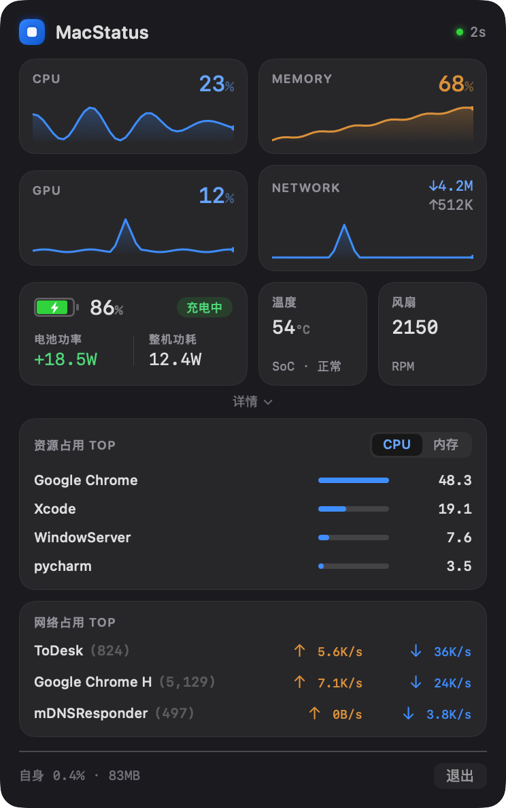

# MacStatus

MacStatus 是一个轻量级 macOS 菜单栏系统监控应用。CPU / GPU / 内存 / 网络实时显示在菜单栏，提供**四种呈现样式**（迷你趋势线 / 环形量规 / 玻璃胶囊 / 水位条）；点开弹窗是玻璃面板卡片式仪表盘——指标趋势、电池与功率、温度与风扇、资源与网络占用 TOP 一目了然；独立设置窗口里指标开关、拖动排序、告警阈值、配色、菜单栏样式都能**即时**定制。纯菜单栏应用、零第三方运行时依赖，数据全部来自 macOS 系统 API。

## 功能

### 菜单栏（常驻）

四种菜单栏样式（自上而下：迷你趋势线 / 环形量规 / 玻璃胶囊 / 水位条）：


- 实时展示 CPU、GPU、内存使用率、网络下行速率。
- 四种呈现样式，设置中**即时**切换：
  - **迷你趋势线** —— 标签 + 实时微型曲线 + 数值。
  - **环形量规**（默认）—— 标签 + 迷你环形进度 + 数值。
  - **玻璃胶囊** —— 整组指标收进一枚半透明胶囊，彩色圆点区分。
  - **水位条** —— 数值在上、细进度条在下的紧凑组合。
- 按阈值三档状态配色：正常·蓝 / 偏高·琥珀 / 过载·玫红，亮暗菜单栏自适应。
- 纯菜单栏应用（无 Dock 图标），支持登录时启动、睡眠/唤醒后自动恢复刷新。

### 弹窗仪表盘（点击菜单栏项）



- **2×2 指标卡**（CPU / 内存 / GPU / 网络）—— 大数字读数 + 最近 60 个采样点的面积趋势线。
- **电源概览排** —— 电源 : 温度 : 风扇三卡并列，详细数据默认收起、点「详情」展开：
  - **电池（笔记本）**：电量、充电状态、剩余时间 / 距充满、健康度与循环数；台式机无电池时整区优雅隐藏。
  - **电池功率**：放电时用 SMC `PPBR` 实时传感器（跟手），充电时用电量计的真实充电功率；**整机功耗**用 SMC `PSTR` 系统总功率。
  - **温度**：CPU/SoC 温度 + 系统热压力状态（正常 / 偏高 / 严重 / 临界）。
  - **风扇**：实时转速（只读监控，不提供风扇控制）。
- **资源占用 TOP** —— CPU / 内存一键切换，进程行带占比条。
- **网络占用 TOP** —— 按进程实时上下行速率。
- 进程类数据仅在弹窗打开时按需采样，关闭即停，**没有 7×24 常驻开销**。

### 设置窗口（右键菜单栏项 → 偏好设置）

- 三个标签页：**常规 / 指标与排序 / 配色与阈值**。
- 指标开关 + 拖动排序，改动**即时**反映到菜单栏。
- 菜单栏样式切换（趋势线 / 环形 / 胶囊 / 水位条）。
- 弹窗区块开关（电池 / 温度 / 风扇 / 进程）。
- 每指标告警阈值（警告 / 严重）与配色（可一键恢复默认）。
- 刷新间隔、登录时启动。
- 所有改动即时生效并跨重启持久化，无需重新启动应用。

## 系统要求

- macOS 14 Sonoma 或更高版本。
- 从源码构建需 Xcode 26 或更高版本。

## 从源码构建

```bash
git clone https://github.com/AF-lmf/mac-status.git
cd mac-status
xcodebuild -project MacStatus/MacStatus.xcodeproj \
  -scheme MacStatus \
  -configuration Release \
  -derivedDataPath build.noindex \
  build
open build.noindex/Build/Products/Release/MacStatus.app
```

也可以直接用 Xcode 打开：

```bash
open MacStatus/MacStatus.xcodeproj
```

构建并直接安装到 `/Applications` 再重启（本机日常使用）：

```bash
scripts/install-local.sh
```

## 使用方式

1. 启动 `MacStatus.app`，菜单栏出现系统状态文本。
2. **左键**点击菜单栏项 → 弹出仪表盘（卡片趋势、电池、功率、进程 Top 5）。
3. **右键**点击菜单栏项 → 偏好设置 / 退出。
4. 在设置窗口里开关指标、拖动排序、调阈值与配色、切换菜单栏样式，改动立即生效。
5. 应用会尝试注册为登录项，之后登录 macOS 时自动启动。

## 下载安装

从 [GitHub Releases](https://github.com/AF-lmf/mac-status/releases/latest) 下载最新版本的 zip 包，解压后把 `MacStatus.app` 拖到 `/Applications`。

该包为 ad-hoc 签名（未公证），首次打开可能被 Gatekeeper 拦截并提示“Apple 无法验证 MacStatus 不包含恶意软件”。任选一种方式放行一次即可，之后正常使用：

- **右键打开**：在 Finder 里右键 `MacStatus.app` → 打开 → 在弹窗里再次点“打开”。
- **系统设置**：系统设置 → 隐私与安全性 → 下方“仍要打开”。
- **终端**：

  ```bash
  xattr -dr com.apple.quarantine /Applications/MacStatus.app
  open /Applications/MacStatus.app
  ```

## 数据来源

- **CPU**：Mach `host_statistics`。
- **内存**：Mach VM statistics 与 memory pressure level。
- **GPU**：IOKit `IOAccelerator` performance statistics，读取不到时降级显示。
- **网络**：BSD `getifaddrs` 网络接口计数器。
- **电池状态**：IOKit Power Sources（电量、充电状态、时间估算）+ `AppleSmartBattery` IORegistry（健康度、循环数、充电功率）。
- **功率**：SMC（System Management Controller）键 —— `PSTR`（整机总功率）、`PPBR`（电池放电功率）。无需任何额外权限（entitlement）。
- **温度**：SMC 温度传感器（按机型选择 CPU/SoC 传感器键）+ `ProcessInfo.thermalState` 系统热压力状态。
- **风扇**：SMC 风扇键（`FNum` 及各风扇转速键），**只读**，不向硬件写入。
- **进程 Top-N**：`libproc`（`proc_listpids` + `proc_pid_rusage`），无需 `task_for_pid`、无额外权限。

## 说明

MacStatus 定位为小而直接的状态栏工具：

- GPU 数据在部分机型或系统版本上可能不可用，会以降级状态显示；内存百分比基于物理内存页统计估算，不等同于 Activity Monitor 的完整内存压力算法。
- 电池卡与整机功耗位于弹窗电源概览排内，**仅在有电池的机型（笔记本）显示**；台式机无电池时整区隐藏。
- 电池功率读数：放电方向用 SMC 实时传感器，跟手；充电方向用电池电量计，准确但更新较慢（充电功率本就缓慢变化）。
- 温度与风扇读数依赖机型的 SMC 键位，部分机型或系统版本上可能读取不到，会以降级或隐藏处理；风扇为**只读监控**，本应用不写入任何风扇控制指令。
