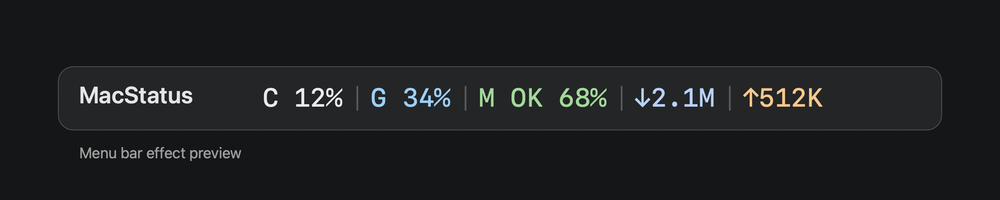

# MacStatus

MacStatus 是一个轻量级 macOS 菜单栏系统监控应用。它把 CPU、GPU、内存压力/使用率和网络上下行速率直接显示在菜单栏里，适合希望不打开窗口也能持续观察系统状态的开发者、运维和重度 macOS 用户。



## 功能

- 菜单栏实时展示 CPU、GPU、内存和网络状态。
- 内存显示采用 `M OK 68%` 这种格式，同时保留压力等级和使用百分比。
- CPU、GPU、内存会按阈值上色，方便快速发现资源压力。
- 网络显示实时下行/上行速率。
- 纯菜单栏应用，无 Dock 图标。
- 支持登录时启动。
- 支持睡眠/唤醒后的自动恢复刷新。
- 无第三方运行时依赖，核心数据来自 macOS 系统 API。

当前菜单栏格式示例：

```text
C 12%  G 34%  M OK 68%  ↓2.1M ↑512K
```

## 系统要求

- macOS 14 Sonoma 或更高版本
- Xcode 26 或更高版本用于源码构建

## 从源码构建

```bash
git clone https://github.com/<your-account>/mac-status.git
cd mac-status
xcodebuild -project MacStatus/MacStatus.xcodeproj \
  -scheme MacStatus \
  -configuration Release \
  -derivedDataPath build \
  build
open build/Build/Products/Release/MacStatus.app
```

也可以直接用 Xcode 打开：

```bash
open MacStatus/MacStatus.xcodeproj
```

## 使用方式

1. 启动 `MacStatus.app`。
2. 菜单栏会出现系统状态文本，例如 `C 12% G 34% M OK 68% ↓2.1M ↑512K`。
3. 右键点击菜单栏项目可以退出应用。
4. 应用会尝试注册为登录项，之后登录 macOS 时自动启动。

如果使用未签名或未公证的 Release 包，macOS 可能会阻止首次打开。可以在 Finder 中右键点击应用并选择“打开”，或自行用 Apple Developer ID 签名和公证后分发。

## Release 包

本项目可以打包成 zip 放到 GitHub Releases。构建并打包命令：

```bash
xcodebuild -project MacStatus/MacStatus.xcodeproj \
  -scheme MacStatus \
  -configuration Release \
  -derivedDataPath build \
  build
mkdir -p dist
COPYFILE_DISABLE=1 ditto --norsrc -c -k --keepParent \
  build/Build/Products/Release/MacStatus.app \
  dist/MacStatus-1.0.zip
```

Release 用户下载 `MacStatus-1.0.zip` 后，解压并把 `MacStatus.app` 拖到 `/Applications` 即可。

## 数据来源

- CPU：Mach `host_statistics`
- 内存：Mach VM statistics 与 memory pressure level
- GPU：IOKit `IOAccelerator` performance statistics，读取不到时会降级显示
- 网络：BSD `getifaddrs` 网络接口计数器

## 说明

MacStatus 目前定位为小而直接的状态栏工具。GPU 数据在部分机器或系统版本上可能不可用，会以降级状态显示；内存百分比是基于物理内存页统计估算的使用率，不等同于 Activity Monitor 的完整内存压力算法。
